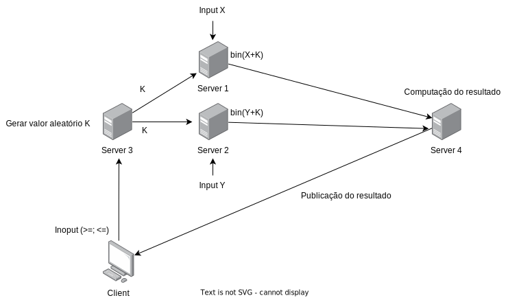

# 1705109_SD_EI_2022-23

ricardo sousa, 1705109

engenharia informatica, inteligencia artificial

# MPC para comparar 2 número

## Descrição
Neste trabalho iremos implementar um protocolo MPC (Multi-Party Protocol) onde 2 servidores irão enviar cada um, 1 número de forma aleatória e irão enviar esse mesmo número para um terceiro servidor que por sua vez irá comparar os números e enviar o resultado da comparação (A < B, A = B, A > B) para um client.

## Implementação

