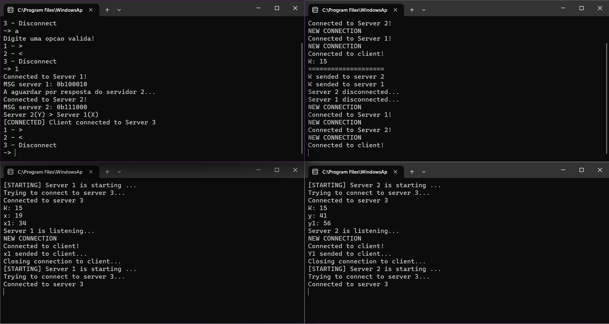

# 1705109_SD_EI_2022-23

ricardo sousa, 1705109

engenharia informatica, inteligencia artificial


# MPC para comparar 2 número

## 1. Descrição do trabalho
Neste trabalho iremos implementar um protocolo MPC (Multi-Party Protocol) onde 2 servidores irão enviar cada um, 1 número de forma aleatória e irão enviar esse mesmo número para um terceiro servidor que por sua vez irá comparar os números e enviar o resultado da comparação (A < B, A = B, A > B) para um client.

## 2. Implementação do trabalho

### 2.1 A computação como serviço

### 2.2 O cliente em pedido

#### Arquitetura


### 2.3 Descrição do funcionamento

- O servidor 3 começa a ouvir na porta 8003;
- O cliente (porta 8000) tenta conectar-se ao servidor 3;
- Após conexão bem sucedida é apresentado um menu de opções ao cliente (1 - =>;2 - <= );
- De seguida os servidores 1 (porta 8001) e 2 (porta 8002) tentam conectar-se ao servidor 3;
- Após o cliente selecionar uma opção, o pedido é enviado para o servidor 3;
- Após o pedido ser enviado para o servidor 3, o cliente desconecta-se do servidor 3 e tenta conectar-se ao servidor 1;
- O servidor K começa a gerar um valor K e envia esse mesmo valor para os servidores 1 e 2;
- Os servidores 1 e 2 geram cada um 1 valor aleatório (Server 1 gera um valor X, Server 2 gera um valor Y);
- O valor K é somado aos respectivos valores aleatórios;
- O resultado da soma de X+K e Y+K são convertidos para binário;
- O servidor 1 é desconectado do Servidor 3 e fica a escutar;
- O servidor 2 é desconectado do Servidor 3 e fica a escutar;
- O cliente conecta-se ao servidor 1;
- O servidor 1 envia o valor em binário resultante da soma de X+K para o cliente;
- O cliente desconecta-se do servidor 1 e tenta conectar-se ao servidor 2;
- O servidor 2 envia o valor em binário resultante da soma de Y+K para o cliente;
- O cliente compara bit a bit, da esquerda para a direita até que um dos bit’s seja diferente. 
#### Protocolo[1]
- Servidor 3 gera aleatoriamente um valor k inteiro
- Servidor 3 entrega k ao Servidor 1
- Servidor 3 entrega k ao Servidor 2 
- Servidor 1 recebe x (input) e k (a partir do Servidor 3). Cria x’1= b(x+k), b(x+k) é o binário de x+k. Servidor 1 entrega x’1 ao Servidor 4
- Servidor 2 recebe y (input) e k (a partir do Servidor 3). Cria y’1= b(y+k), b(y+k) é o binário de y+k. Servidor 2 entrega y’1 ao Servidor 4
- Servidor 4 recebe x’1 de Servidor 1 e y’1 de Servidor 2. Compara bit a bit x’1 com y’1 da esquerda para a direita.
Ou encontra dois bits distintos e nesse caso, o primeiro bit distinto maior indica o inteiro maior. Ou não
encontra e nesse caso os inteiros são iguais. Emite o resultado como output.

## 3. Funcionamento do trabalho


Na imagem acima é possível verificar que o servidor 1, o servidor 2 e o cliente se conectam ao servidor 3 de forma a que o cliente possa efetuar os pedidos e o servidor 3 possa enviar o valor K para os servidores 1 e 2.


A validação do input do utilizador consiste na verificação se o input se encontra entre 1 e 3 e se é realmente um número.


Ao ser introduzido o valor 1 no cliente, o servidor 3 irá gerar um valor K, neste caso 15, de seguida envia o valor K para o servidor 1 e para o servidor 2. O servidor 1 e o servidor 2 geram eles próprios um valor aleatório, no caso 19 e 41 respetivamente.
O valor K é somado ao valor do x e ao valor y, sendo o resultado das somas convertido em binário.
Estes valores são depois enviados para o cliente sendo que este compara bit a bi ambos os números de forma a descobrir qual o maior/menor.


Como podemos verificar, se apenas for iniciado o servidor 3, o cliente e um dos outros 2 servidores, o cliente não consegue interagir pois são necessários para além do servidor 3 e do cliente os servidores 1 e 2.

## 4. Como executar o projeto localmente
Clone o projeto

```bash
  git clone https://github.com/Ricardo-Sousa-hub/1705109_SD_EI_2022-23.git
```

Entrar no diretório do projeto

```bash
  cd 1705109_SD_EI_2022-23/MPC
```

Executar o Server 3

```bash
  python Server3.py
```


Executar o Server 2

```bash
  python Server2.py
```

Executar o Server 1

```bash
  python Server1.py
```

Executar o Client

```bash
  python Client.py
```

## 5. Conclusão
// descrever brevemente o que se fez e o que faltou fazer

## Bibliografia
 - [1] paulo vieira EI_Leitura-10-Sockets em Python
 - https://www.youtube.com/watch?v=3QiPPX-KeSc&t=2s&ab_channel=TechWithTim
 - https://realpython.com/python-sockets/
 - [Documentação da libraria socket](https://docs.python.org/3/library/socket.html)

